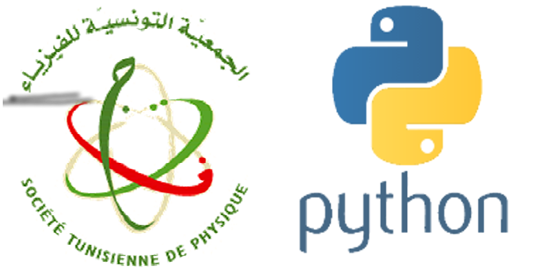

# Physique Numérique avec Python

Cette formation a pour but l'initiation: des étudiants en mastère, des doctorants et éventuellement des enseignants, à l'utilisation de Python pour apprendre à développer des codes interfacés et adaptés à leurs projets d'étude. 

<h4>Société Tunisienne de Physique ; 15-16-17  mars 2021</h4>

<h4>Faculté des Sciences de Tunis</h4>

 

 

## Formateurs

* Prof. Hassen Ghalila (1)
* Dr. Ahmed Ammar (1,2)
* Dr. Fahmi Khadri (1)

1. Faculé des Sciences de Tunis, Université de Tunis El Manar.
2. Institut Préparatoire aux Études Scientifiques et Techniques, Université de Carthage.

# Programme
* [Présentation d'ouverture](https://astrax.github.io/PhysNum2021/presentations/Ecole_PhysNum_21.pdf)
* [Presentation des ateliers](https://astrax.github.io/PhysNum2021/presentations/main.pdf)

## Atelier I : 15 mars 2021

* Installation de l'environnement de progrmmation Anaconda
* Implémentation des premiers codes Python (Spyder)
* Introduction aux librairies scientifiques (Numpy et Matplotlib)
* Exercices

**Scripts :** [J1_ProjetPi](https://github.com/astrax/PhysNum2021/tree/main/J1_ProjetPi)

## Atelier II : 16 mars 2021

* Intégration numérique
* Exercices

**Scripts :** [J2_ProjetIntegral](https://github.com/astrax/PhysNum2021/tree/main/J2_ProjetIntegral)

**Notebook :** [Débuter avec les notebooks Python](https://colab.research.google.com/github/astrax/PhysNum2021/blob/main/J2_Notebook_sinc/ProjetSinc.ipynb)

## Atelier III : 17 mars 2021

* Simulation d'expériences d'optique ondulatoire
* Exercices

**Notebook :** [Un aperçu sur l'utilisation de Python pour simuler des expériences de physique](https://colab.research.google.com/github/astrax/PhysNum2021/blob/main/J3_ProjetOptique/optique.ipynb)

